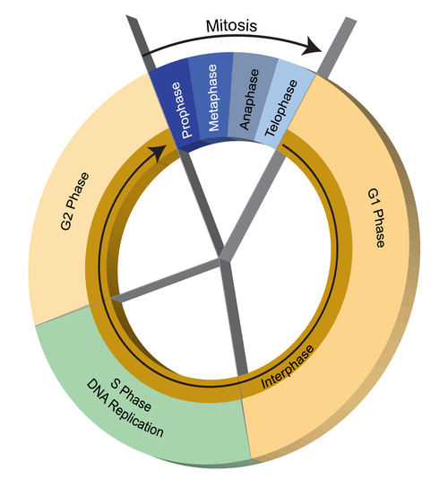
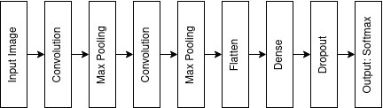
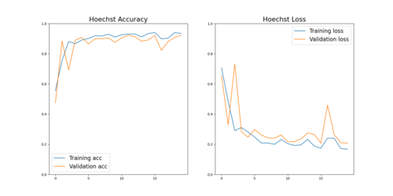
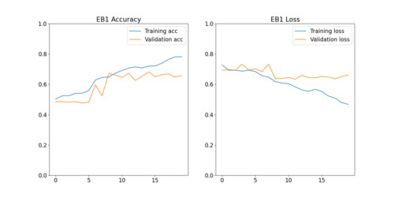
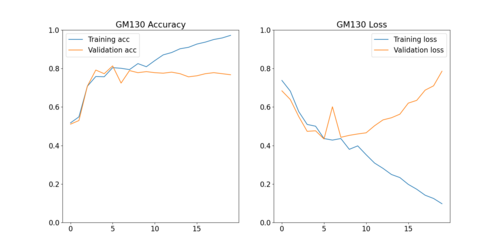
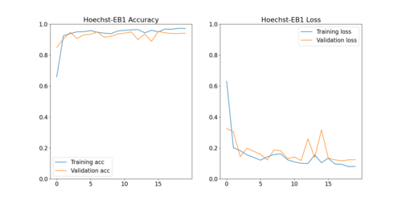
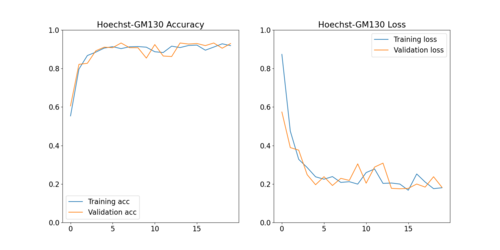

# Motivation 

The adoption of GPU computing has been a boon for computer vision and image processing problems. Particularly, in deep learning domain, by enabling massively parallel computing, we can easily and quickly solve image classification problems. In this capstone project, we take inspiration from these ideas and solve an image classification problem (identifying cell cycle phase) using `Tensorflow` and `CUDA CNN` package. 

Instruction of how to execute the code and proof of execution is provided [here](#code-execution)

 

# Background 

Cell cycle is a series of events that a cell goes through in order to replicate it into two new daughter cells. There are two distinct phases of this process, namely interphase and mitosis. During interphase, a cell grows and doubles its DNA material by replicating and then during mitosis, the DNA material and other cellular organelles get equally distributed to two daughter cells.  



The interphase can be subdivided into three stages: 

* G1 Phase: The cell grows physically larger, copies organelles, and makes the molecular building blocks it will need in later steps. 
* S Phase: The cell synthesizes a complete copy of the DNA in its nucleus and also duplicates a microtubule-organizing structure called the centrosome. 
 * G2 Phase: The cell grows more, makes proteins and organelles, and begins to reorganize its contents in preparation for mitosis. 

 
These changes in cellular structure can be captured via microscope and proper staining techniques. In this project, we use labeled data that identify various stages of interphase to train a convolutional neural network (CNN) and later use that model to identify cell cycle stage.  

 

# Data 

We used the image data from [Nagao Y _et al._](https://www.ncbi.nlm.nih.gov/pmc/articles/PMC7353138/) to train and test the model. The image data consists of the following staining channels: 

* Hoechst: This channel captures the DNA material present in a cell and can be used to differentiate between G1/S and G2 stages. 

* GM130: This channel captures the Golgi apparatus which usually doubles in quantity during G1 and gets properly distributed in G2 stage, right before mitosis. 

* EB1: This channel captures the microtubule patterns which become more prominent in G2 stage to pave way for spindle formation in mitosis.  

The cells were stained with either Hoechst and GM130 combination (1848 training and 113 test images) or Hoechst and EB1 combination (1884 training and 116 test images). 

 

# Model 

Our CNN model consists of the following layers: 
* Input layer 
* Two pairs of convolution and max pooling layer 
* A flatten layer 
* A fully connected layer 
* A dropout layer (0.03%) 
* A softmax layer as output 



We used a `binary cross-entropy` loss function and `Adam` optimizer from the `Keras` package to train the model.  
We used 5 different sets of channel combinations to train the model and evaluate the predictions. These combinations are: 
* Hoechst  
* GM130 
* EB1 
* Hoechst + GM130 
* Hoechst + EB1 

We trained each combination for 20 epoch and observed the loss and accuracy of each model.  

# Result 

Here we can see the training history for various channel combination.








The loss and accuracy of each combination after 20 epoch is given below: 

| Channels        | Training Loss (%) | Training Accuracy (%) | Validation Loss (%) | Validation Accuracy (%) | Test Loss (%) | Test Accuracy (%) | 
|-----------------|-------------------|-----------------------|---------------------|-------------------------|---------------|-------------------|
| Hoechst         |             16.73 |                 93.43 |               20.68 |                   92.31 |         21.21 |             89.66 | 
| GM130           |              9.74 |                 97.23 |               78.60 |                   76.76 |         86.18 |             73.45 |
| EB1             |             47.94 |                 78.10 |               65.15 |                   65.78 |         82.07 |             56.90 |
| Hoechst + GM130 |             18.05 |                 91.88 |               18.25 |                   92.97 |         20.55 |             91.15 |
| Hoechst + EB1   |              8.08 |                 97.21 |               12.38 |                   94.16 |         29.71 |             88.79 |


As we can see here, the Hoechst channel alone can provide a very good prediction compared to the two other channels. This can be linked to the fact that the change in absolute amounts of DNA material is much higher than the Golgi apparatus and microtubules and hence it gets detected very well by CNN.  

The EB1 channel itself does not provide us with good predictions and combining this with Hoechst channel also does not improve the prediction by solo Hoechst channel.  

However, combining Hoechst and GM130 provides the best prediction to differentiate between S/G1 and G2 stages. 

 

# Reference 

Nagao Y, Sakamoto M, Chinen T, Okada Y, Takao D. Robust classification of cell cycle phase and biological feature extraction by image-based deep learning. Mol Biol Cell. 2020 Jun 15;31(13):1346-1354. doi: 10.1091/mbc.E20-03-0187. Epub 2020 Apr 22. PMID: 32320349; PMCID: PMC7353138. 

 
# Code Execution
The data for the project can be downloaded from Zenodo using this [link](https://zenodo.org/records/3745864).
We also need `Tensorflow` along with `CUDA` runtime installed in the environment so that `cudaCNN` library can be used within `Tensorflow`. The instruction to install `Tensorflow` along with `CUDA` support varies from OS to OS and the detail instruction can be found [here](https://www.tensorflow.org/install/pip).

Once the data files are downloaded and extracted, and placed in a directory, we can call the `Python` script to run the CNN models.
```
(base) jovyan $ python cuda_cnn_proj.py --data-path=/home/jovyan/work/cuda_capstone/ --batch-size=64 --epochs=20

```
The `data-path` argument points to the root path for all the training data folder. The `batch-size` argument dictates how many images will be processed in a single batch and the `epochs` parameter sets the number of epochs for the training.

The output from a sample execution and the related graphs are stored [here](https://github.com/sameeul/cuda_capstone/tree/main/output) as a proof of execution.